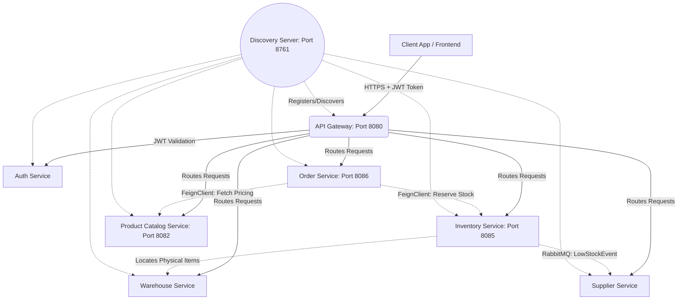

# Flowstock: In-Depth Architecture & Project Deep Dive

## 1. Project Technology Stack & Database Strategy
Flowstock utilizes a distributed microservices architecture implementing the **Database-per-Service** pattern to guarantee loose coupling and domain isolation.

- **Core Languages & Frameworks:** Java 23, Spring Boot 3.3.5, Spring Cloud 2023.0.3
- **Databases:** PostgreSQL is the primary relational database. Services like `inventory-service` and `order-service` isolate their data using dedicated database schemas (`inventory`, `orders`) within the main database, while `product-catalog-service` operates on entirely separate logical databases (`flowstock_catalog`).
- **Schema Management:** Flyway is embedded in the services (`baseline-on-migrate: true`) to strictly version-control SQL schemas.
- **Caching & Distributed Locks:** Redis is heavily utilized in the `inventory-service` to manage distributed state.
- **Asynchronous Messaging:** RabbitMQ is configured as the message broker for event-driven choreography.
- **Synchronous Communication:** OpenFeign handles blocking REST interactions (e.g., Order Service querying Catalog Service) with strictly defined `5000ms` connect and read timeouts to prevent thread exhaustion.

### Comprehensive Service Flowchart

---

## 2. Microservices Code-Level Deep Dive

### 1. API Gateway & Discovery Server
- **Discovery Server (Port 8761):** Utilizes Netflix Eureka. All services register themselves with `prefer-ip-address: true` so the gateway can seamlessly route traffic to dynamic Docker containers or Kubernetes pods.
- **API Gateway (Port 8080):** Spring Cloud Gateway intercepts all traffic. It is responsible for edge-level concerns: path rewriting, global CORS configuration, and potentially rate-limiting.

### 2. Auth Service
- **Core Responsibility:** Stateless Identity and Access Management (IAM).
- **Implementation:** Uses `jjwt:0.12.6`. The service exposes `/login` and `/register`. It issues cryptographically signed JSON Web Tokens (JWT). A custom `AuthException` handler standardizes HTTP status codes and error payloads (e.g., missing credentials or `INVALID_ADMIN_SECRET`).

### 3. Product Catalog Service (Port 8082)
- **Core Entities:** `Product`, `Category`, `Brand`.
- **Implementation:** Acts as the master data hub. It utilizes Lombok (`@Builder`, `@Data`) and MapStruct to translate JPA Entities into lightweight DTOs (`ProductDTO`, `CategoryDTO`) before shipping them over the network.

### 4. Inventory Service (Port 8085)
- **Core Entities:** `InventoryItem`, `InventoryReservation`.
- **Configurations:**
  - `inventory.low-stock-threshold: 10`
  - `inventory.lock.ttl-seconds: 30`
  - `inventory.lock.retry-attempts: 5`
  - `inventory.lock.retry-delay-ms: 200`
- **Implementation:** Serves as a highly-concurrent ledger. By configuring distributed locks via Redis, it ensures that two simultaneous orders cannot reserve the same final piece of stock.

### 5. Order Service (Port 8086)
- **Core Entities:** `Order`, `OrderItem`, `OrderStatus` (Enum), `PaymentStatus` (Enum).
- **Implementation:** The orchestration hub. It receives the user's cart, translates it into an `Order`, and orchestrates calls to `inventory-service` and `product-catalog-service` to ensure the cart is physically and financially viable before committing the transaction.

---

## 3. Advanced Situation-Based Scenarios

### Scenario A: Distributed Transaction & Stock Locking (The Order Flow)
**Situation:** A user attempts to purchase 5 laptops. Because the system is distributed, how does it ensure data consistency?
**Answer:** 
1. The user hits `POST /orders` on the API Gateway.
2. The Gateway routes to `order-service`.
3. `order-service` uses an `@FeignClient` to call `product-catalog-service` to ensure the laptop SKU exists and fetches the exact, untampered current price.
4. `order-service` calls `inventory-service` via REST to reserve 5 laptops.
5. **CRITICAL:** `inventory-service` acquires a Redis distributed lock for the SKU (with 5 retry attempts and 200ms delay). This prevents race conditions. It creates an `InventoryReservation` record and deducts 5 from the `availableQty`.
6. `order-service` saves the `Order` to its PostgreSQL database with `OrderStatus.PENDING`.
7. **Rollback Scenario:** If the payment subsequently fails, a compensating transaction (Saga pattern) is triggered. `order-service` commands `inventory-service` to delete the `InventoryReservation` and restore the 5 laptops back to `availableQty`.

### Scenario B: High Traffic & Network Resilience
**Situation:** A flash sale causes a 100x traffic spike. How does the architecture prevent the databases from melting down?
**Answer:**
The system scales horizontally. The `api-gateway` acts as a shock absorber. Eureka detects the heavy load, allowing operations to spin up multiple instances of `order-service` dynamically. Furthermore, `order-service` enforces a `5000ms` Feign Client read timeout. If the Inventory database locks up, the network connection drops rather than hanging indefinitely. This triggers an HTTP 503 instead of cascading thread exhaustion, keeping the rest of the application alive.

### Scenario C: Automated Procurement (Event-Driven Integration)
**Situation:** The last 10 smartphones are sold, dropping the stock to critically low levels. We need more from the supplier immediately.
**Answer:** 
When `inventory-service` commits a stock deduction, a background process evaluates if the new `availableQty < inventory.low-stock-threshold` (which is configured to `10` in `application.yml`). If true, `inventory-service` publishes an asynchronous `LowStockEvent` to a RabbitMQ exchange. The `supplier-service`, which acts as a consumer on this queue, intercepts the event and automatically generates a `PurchaseOrder` mapped to the registered vendor—restocking the warehouse without any human intervention.
